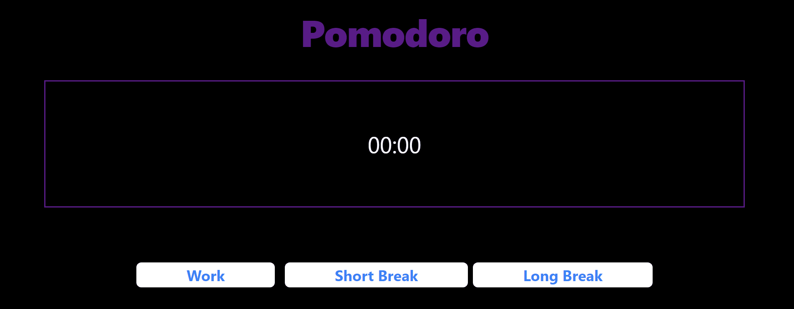
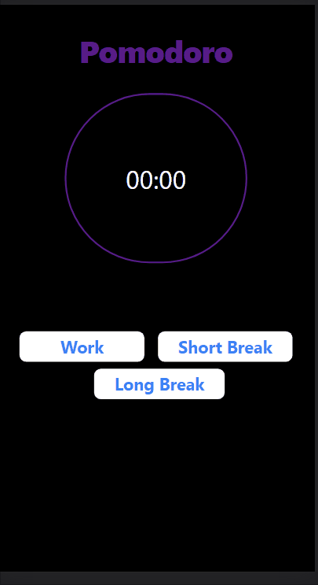

# Getting Started with Pomodoro App

I have made this app on the basis on the technique Pomodoro. 
It is a time management technique based on 25-minute stretches of focused work broken by five-minute breaks. Longer breaks are typically for 15 to 30 minutes. 

I have used ReactJS, Taileind and HTML in this

### Checkout the live website [here](https://pomodoro-app-pearl.vercel.app/)

## How the website looks like

